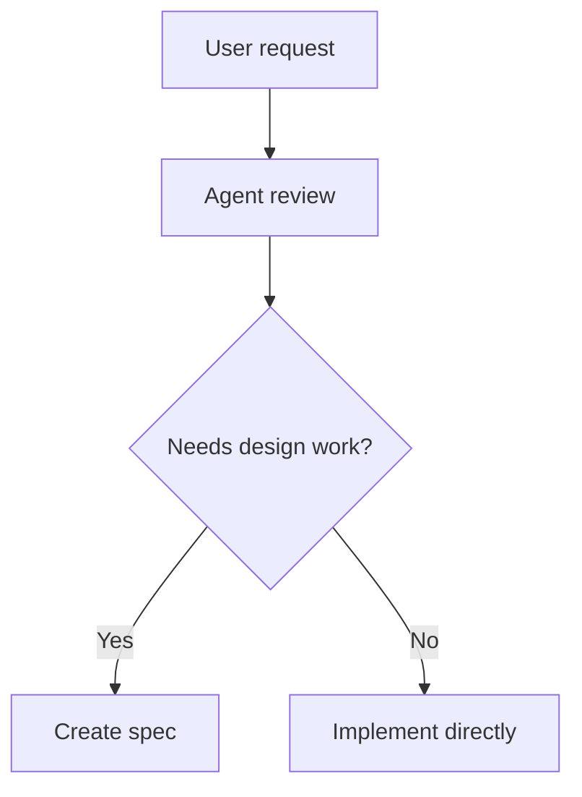

# Mermaid

Use Mermaid when the diagram should live in documentation or source control as plain text.

## Best fit

- Flowcharts
- Sequence diagrams
- State diagrams
- Entity relationship diagrams
- Lightweight architecture overviews
- Process and decision trees

## Use it when

- The user wants a diagram that can be reviewed in git diffs
- The artifact should remain close to the written docs
- You need a quick, durable representation of a process or system
- A visual answer should be portable across repos and editors

## Avoid it when

- The diagram is too dense to remain readable in text form
- You need free-form spatial editing
- The diagram is exploratory and likely to change significantly
- The target repo has a stronger canonical diagram format

## Workflow

1. Pick the smallest diagram type that fits the question.
2. Keep node labels short and meaningful.
3. Split large diagrams into multiple smaller ones.
4. Validate syntax before treating the diagram as complete.

## Good practices

- Prefer readability over perfect completeness
- Use consistent naming across diagrams
- Keep flows linear where possible
- Add only the relationships needed to answer the current question

## Example usage

## Cross-repo use

- Keep this skill repo-agnostic
- Do not hard-code stack-specific diagram conventions
- If the repo has a docs standard, adapt diagram naming and placement to match it
